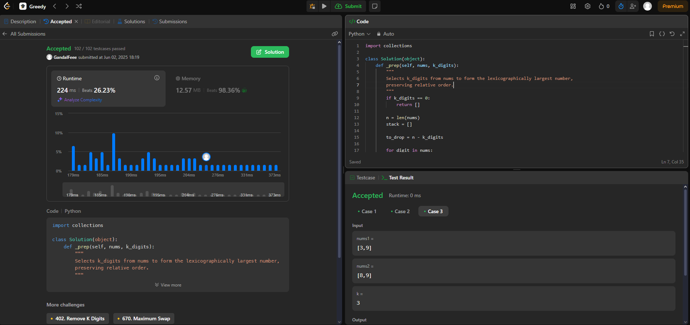
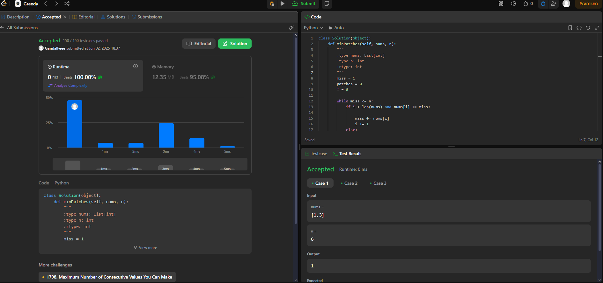
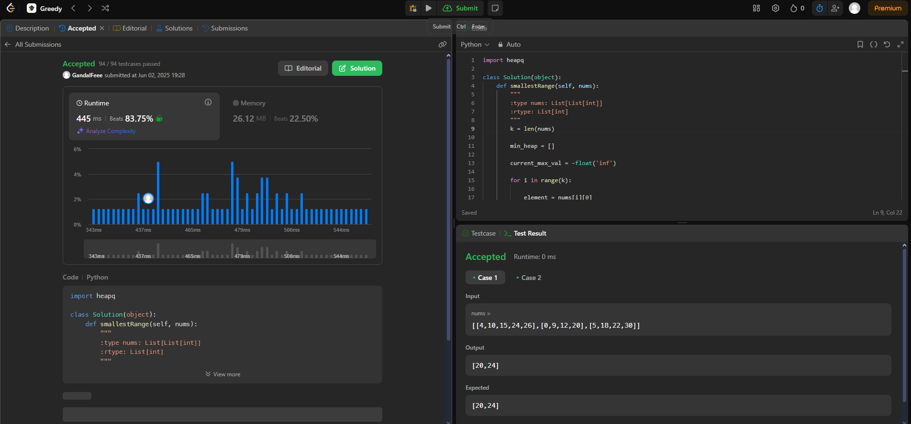

# ALGORITMOS AMBICIOSOS - HACKERRANK END LEETCODE PROBLEM

**Conteúdo da Disciplina**: Algoritmos ambiciosos

## Sobre

Este projeto consiste na resolução de questões da plataforma HackerRank e leetcode variando nas dificuldades de médio e difícil. O objetivo é utilizar o conteúdo estudado.

## Questões

</head>
<body>

<table>
    <thead>
        <tr>
            <th>Questão</th>
            <th>Nível</th>
        </tr>
    </thead>
    <tbody>
        <tr>
            <td><a href="https://www.hackerrank.com/challenges/interval-selection/problem" target="_blank">Interval Selection</td>
            <td>Médio 01</td>
        </tr>
        <tr>
            <td><a href="https://www.hackerrank.com/challenges/task-scheduling/problem" target="_blank">Task Scheduling</td>
            <td>Difícil 01</td>
        </tr>
        <tr>
            <td><a href="https://www.hackerrank.com/challenges/chief-hopper/problem?isFullScreen=false" target="_blank">Chief Hopper</td>
            <td>Difícil 02</td>
        </tr>
        <tr>
            <td><a href="https://www.hackerrank.com/challenges/chief-hopper/problem?isFullScreen=false" target="_blank">321. Create Maximum Number</td>
            <td>Difícil 03</td>
        </tr>
        <tr>
            <td><a href="https://leetcode.com/problems/patching-array/description/?envType=problem-list-v2&envId=greedy" target="_blank">330. Patching Array</td>
            <td>Difícil 04</td>
        </tr>
        <tr>
            <td><a href="https://leetcode.com/problems/smallest-range-covering-elements-from-k-lists/description/?envType=problem-list-v2&envId=greedy" target="_blank">632. Smallest Range Covering Elements from K Lists</td>
            <td>Difícil 05</td>
        </tr>
    </tbody>
</table>

</body>
</html>

## Contribuidores

</head>
<body>

<table>
    <thead>
        <tr>
            <th>Matrícula</th>
            <th>Nome</th>
            <th>GitHub</th>
        </tr>
    </thead>
    <tbody>
        <tr>
            <td>202046102</td>
            <td>Felipe das Neves Freire</td>
            <td><a href="https://github.com/FelipeFreire-gf" target="_blank">Felipe</a></td>
        </tr>
        <tr>
            <td>222037700</td>
            <td>Leonardo de Melo Lima</td>
            <td><a href="https://github.com/leozinlima" target="_blank">Leonardo</a></td>
        </tr>
    </tbody>
</table>

</body>
</html>

## Linguagem Utilizada

- Python

## Uso

Entrar na plataforma [HackerRank](https://www.hackerrank.com/dashboard), procurar pelo nome/número do exercício, colar na aba code e clicar em _Run Code_
Entrar na plataforma [LeetCode](https://leetcode.com/problem-list/greedy/), procurar pelo nome/número do exercício, colar na aba code e clicar em _Run ou Submit_

## Screenshots do HackerRank e LeetCode

  
<b>Figura 1: Resultados questão média Interval Selection</b>

  
<b>Figura 2: Resultados questão média Interval Selection</b>

  
<b>Figura 3: Resultados questão média Interval Selection</b>

  
<b>Figura 4: Resultados questão difícil Task Scheduling</b>

  
<b>Figura 5: Resultados questão difícil Task Scheduling</b>

  
<b>Figura 6: Resultados questão difícil Chief Hopper</b>

  
<b>Figura 7: Resultados questão difícil Chief Hopper</b>

  
<b>Figura 8: Resultados questão difícil Chief Hopper</b>

  
<b>Figura 9: Resultados questão difícil: 321. Create Maximum Number</b>

  
<b>Figura 10: Resultados questão difícil: 330. Patching Array</b>

  
<b>Figura 11: Resultados questão difícil: 632. Smallest Range Covering Elements from K Lists</b>

## Vídeo

Explicamos todos os códigos que fizemos na plataforma HackerRank e LeetCode:

</head>
<body>

<table>
    <thead>
        <tr>
            <th>Vídeo 01</th>
        </tr>
    </thead>
    <tbody>
        <tr>
            <td><a href="https://youtu.be/4WmcZYB2E8Q" target="_blank">HackerRank end Leetcode Problem</a></td>
        </tr>
    </tbody>
</table>

</body>
</html>
